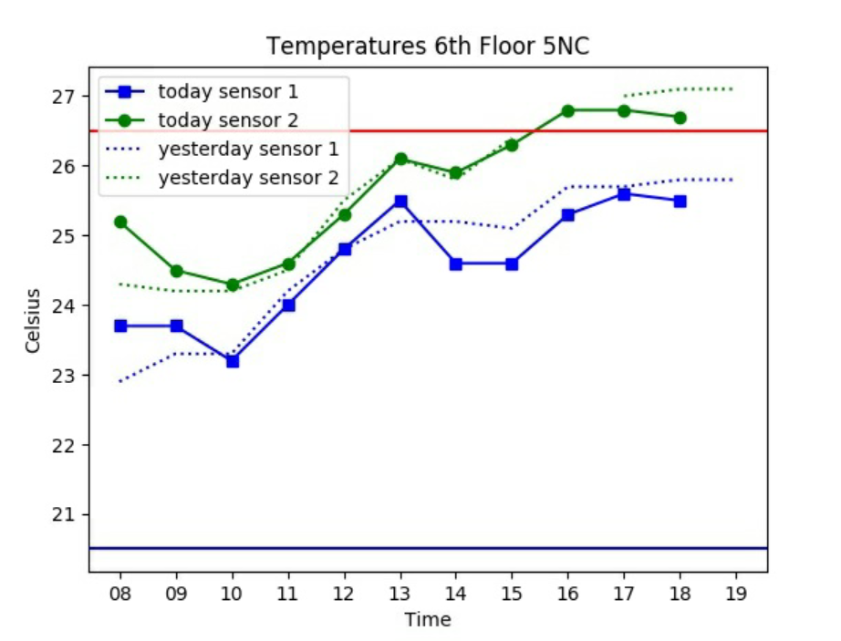
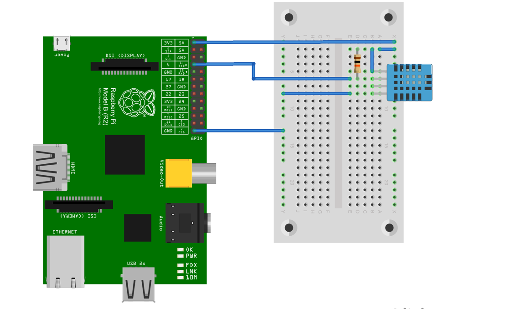
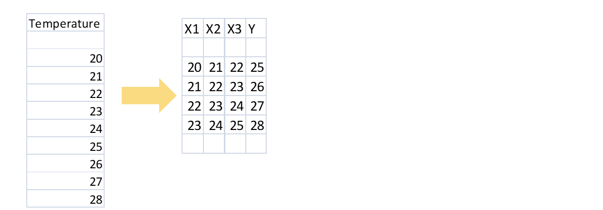
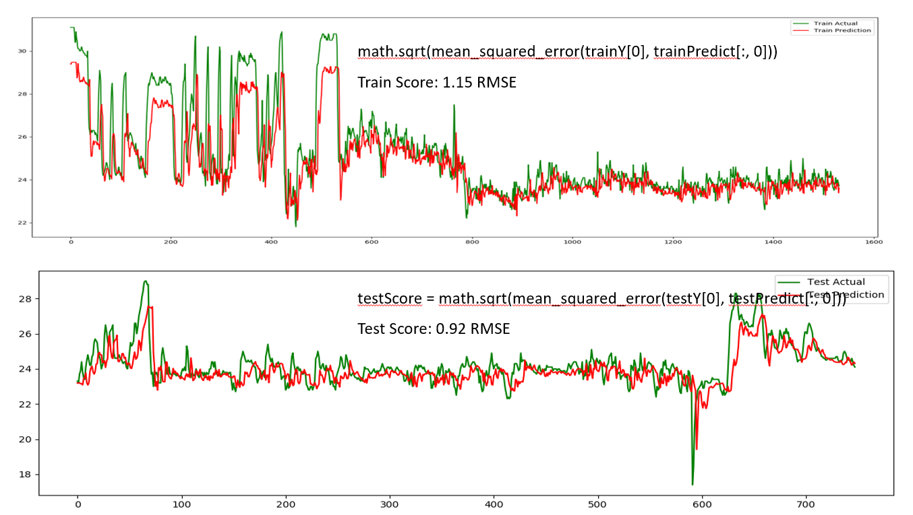

Raspberry Environment Analysis
==============================

This project is designed to monitor temperature and humidity level with
a raspberry pi, send out alerts if certain thresholds are exceeded.
In addition it allows to the use of prediction models to forecast
future levels of temperature.

Usage:
------

Run:

-  Install Anaconda, I would also recommend to install pycharm.
- ``pip install -r requirements.txt``
- Run ``app.py``

Packages
~~~~~~~~

Raspberry environment analysis consists of 3 packages:

- ``sensor_reader``: This package is installed on the raspberry pi and reads temperature from the sensors once an hour, and stores them into a database
- ``temp_analyzer``: This process checks if a threshold has been exceeded, if so an email alert it sent out.
- ``prediction_models``: Train and predict future temperature

Sending out email alerts
~~~~~~~~~~~~~~~~~~~~~~~~

Using ``app.py email LIMIT [options]`` an email is sent out with a summary
of today's and yesterday's temperature, if the last temperature is above the
given threshold.

DH11 temperature sensor
~~~~~~~~~~~~~~~~~~~~~~~

Use a DH11 temperature sensor to connect to your raspberry pi:

Time series predictionPreparing the data for a neural network
~~~~~~~~~~~~~~~~~~~~~~~~~~~~~~~~~~~~~~~~~~~~~~~~~~~~~~~~~~~~~~

.. code:: python

    def create_dataset(self, dataset, look_back=3, look_ahead=3):
            dataset = dataset.reshape(-1)
            shape = dataset.shape[:-1] + (dataset.shape[-1] - look_back + 1, look_back)
            strides = dataset.strides + (dataset.strides[-1],)
            X = np.lib.stride_tricks.as_strided(dataset, shape=shape, strides=strides)[0:-look_ahead]
            Y = dataset[look_back + look_ahead - 1:]

The following procedures need to be performed on the data:

- Normailzation
- Splitting into training, validation and test set
- Early stopping of training of the neural network

We can then create a model to predict the temperture. For example as follows:

.. code:: python

     # create and fit the LSTM network
            self.model = Sequential()
            self.model.add(LSTM(4, input_shape=(1, look_back)))
            self.model.add(Dense(1))
            self.model.compile(loss='mean_squared_error', optimizer='adam')
            self.model.fit(trainX, trainY,
                           epochs=100,
                           batch_size=batchsize, verbose=1,
                           callbacks=[self.tbCallBack,
                                      self.early_stop])

Using RNN to predict time series and a  10 hours lookback, we get the following results:

Can you do better?

How to integrate your code on Github
~~~~~~~~~~~~~~~~~~~~~~~~~~~~~~~~~~~~

To contribute do the following:

- Get Pycharm and build the virtual python environment. Use can do: ``pip install -r requirements.txt``
- Clone your fork to your local machine. You can do this directly from pycharm: VCS --> check out from version control --> git
- Add as remote the original repository where you created the fork from and call it upstream (the connection to your fork should be called origin). This can be done with vcs --> git --> remotes
- Create a new branch: click on master at the bottom right, and then click on 'new branch'
- Make your edits.
- Ensure all tests pass. Under file --> settings --> python integrated tools switch to pytest (see screenshot). |image1| You can then just right click on the tests folder and run all tests. All tests need to pass. Make sure to add your own tests by simply naming the funtion test\_... \
- Make sure all the tests are passing. Best run pytest as described above (in pycharm just right click on the tests folder and run it). If a test fails, you can debug the test, by right clicking on it and put breakpoints, or even open a console at the breakpoint: https://stackoverflow.com/questions/19329601/interactive-shell-debugging-with-pycharm
- Commit your changes (CTRL+K}
- Push your changes to your origin (your fork) (CTRL+SHIFT+K)
- To bring your branch up to date with upstream master, if it has moved on: rebase onto upstream master: click on your branch name at the bottom right of pycharm, then click on upstream/master, then rebase onto. You may need to resolve soe conflicts. Once this is done, make sure to always force-push (ctrl+shift+k), (not just push). This can be done by selecting the dropdown next to push and choose force-push (important: don't push and merge a rebased branch with your remote)
- Create a pull request on your github.com to merge your branch with the upstream master.
- When your pull request is approved, it will be merged into the upstream/master.
